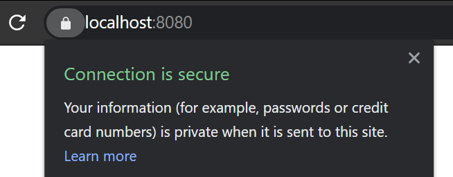
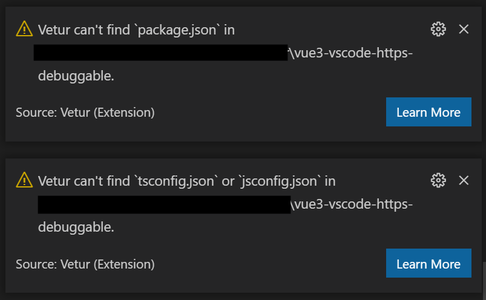
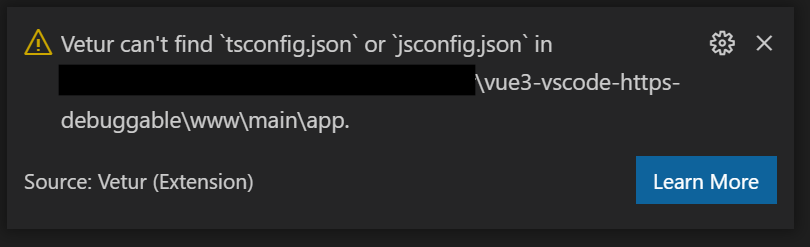

# Vue 3 + HTTPS + Windows + VS Code + Debugging

Vue debugging does work in Windows through VS Code and Chrome, but I really struggled to get it working with the guides that I found. I'm not saying that they aren't good guides, but there are a few things that were not totally clear to me, so hopefully this guide will fill in the gaps.

## Prerequisites

1. [PowerShell 7+](https://github.com/PowerShell/PowerShell/releases) - this isn't completely necessary, but it is a really nice terminal and feels significantly more Unix-like than `cmd.exe` or the previous generation of PowerShell.

   To use PowerShell as the default shell in the VS Code terminal you need to paste the following line into your user settings file.

    ```json
    "terminal.integrated.shell.windows": "C:\\Program Files\\PowerShell\\7\\pwsh.exe"
    ```

2. [Anaconda](https://www.anaconda.com/products/individual) - again you don't absolutely need Anaconda, however it provides an easy way to get specific versions of applications and run them side by side and means that you can (almost) exactly replicate my environment.

3. [64-bit Git For Windows](https://git-scm.com/download/win) - again you don't absolutely need to have this, but in order to serve a site over `HTTPS` you need to generate a certificate with `openssl` and this comes with Git, which you probably already have. The choice is really to get  `openssl` as part of a trusted application like Git, or to get a standalone binary file of unknown provenance, personally I would opt for the former.

## NodeJS in Anaconda

Once you have Anaconda installed you will need to initialize it so that it can be used from the command line. This should be as simple as opening a PowerShell prompt and issuing the command:

```powershell
> conda init powershell
```

The most recent versions of Anaconda should work out of the box in PowerShell 7+, but if not you can try [this guide](https://hackf5.medium.com/how-to-enable-anaconda-in-powershell-7-on-windows-394ba62c3f9c).

I am going to use NodeJS 12 because Vue raises some warnings if you use a more recent version:

```powershell
> conda create --name node12
> conda activate node12
> conda install -c conda-forge nodejs=12.19.0 
```

## The Vue CLI

I'm going to use the [Vue CLI](https://cli.vuejs.org/guide) to scaffold my Vue project, this is an easy way of getting a basic Vue "Hello World!" up and running.

```powershell
>  npm install -g @vue/cli
```

## Create the Vue App

Most guides start by initializing an app in the root folder of the VS Code workspace, but this doesn't really represent how most real codebases are structured, and due to the fiddly nature of the Vue debugging setup I'm going to go nest the app below the root.

So open a command prompt somewhere that you want to create your workspace and issue the following command.

```powershell
> mkdir vue-project
> cd vue-project
> code .
```

This will open the folder `vue-project` as a new VS Code workspace. From now on you can use the VS Code terminal, but don't forget to activate the `node12` conda environment before you work with node.

```powershell
> conda activate node12
```

From the terminal create a directory to hold the app

```powershell
> mkdir www/main
> cd www/main
```

Now you can scaffold the Vue App.

```powershell
> vue create app
```

Choose the default Vue 3 option which might be called `Default (Vue 3 Preview)`. After it has finished generating you can try running the app.

```powershell
> cd app
> npm run serve
```

This will display the url that point to your app, which is probably `http://localhost:8080/`, ctrl + click on this to see it running. Press CTRL + C to stop it.

## HTTPS

Sure, you can serve your site over `HTTP`, but since these days everything is `HTTPS` it is nice to get the site running over the secure protocol.

In order to use `HTTPS` you will need `openssl.exe` which I assume you have as part of Git for Windows and it is in the default location of `C:\Program Files\Git\usr\bin\openssl.exe`.

In the `www` folder create a new folder called `certs`.

```powershell
> mkdir certs
```

In the `www/certs` folder create a file called `openssl.cnf` with the following content.

```ini
FQDN = {FQDN}

ORGNAME = example

[req]
default_bits = 2048
default_md = sha256
prompt = no
encrypt_key = no
distinguished_name = req_distinguished_name
x509_extensions = v3_req
utf8=yes

[req_distinguished_name]
C = UK
O = $ORGNAME
CN = *.$FQDN

[v3_req]
subjectAltName = @alt_names

[alt_names]
DNS.1 = $FQDN
DNS.2 = *.$FQDN
```

The purpose of this file is to provide most of the configuration settings needed by `openssl`. This config will allow you to serve both `localhost` and all subdomains of `localhost` like `api.localhost` over `HTTPS`. We won't be serving any subdomains, but `openssl` is so finicky and tricky to set up, and this is such a standard thing to want to do that I thought I would add this to the config.

Also in the `www/certs` folder create a file called `New-SelfSignedCert.ps1` with the following content.

```powershell
# see https://stackoverflow.com/questions/27294589/creating-self-signed-certificate-for-domain-and-subdomains-neterr-cert-commo

#Requires -RunAsAdministrator

function New-SelfSignedCert {
    $opensslPath = "C:\Program Files\Git\usr\bin\openssl.exe"
    
    if (-not (Test-Path $opensslPath)) {
        Write-Error "Could not find $opensslPath, this probably means you don't have " `
            + "64-bit Git for Windows installed (https://git-scm.com/download/win)"
    }

    Set-Alias openssl $opensslPath
    
    $certDir = "$PSScriptRoot\.certs"
    [System.IO.Directory]::CreateDirectory($certDir)

    $fqdn = "localhost"
    $key = "$certDir\$fqdn.key"
    $crt = "$certDir\$fqdn.crt"

    $sslCnf = (Get-Content -Path "$PSScriptRoot\openssl.cnf").Replace("{FQDN}", $fqdn)
    $sslCnfFile = [System.IO.Path]::GetTempFileName()
    Set-Content -Path $sslCnfFile -Value $sslCnf

    try {
        openssl req -x509 -sha256 -nodes -days 3650 -newkey rsa:2048 -keyout $key -out $crt  -config $sslCnfFile

        Import-Certificate -FilePath $crt -CertStoreLocation Cert:\LocalMachine\Root
    }
    finally {
       Remove-Item $sslCnfFile
    }
}

New-SelfSignedCert
```

This script must be run with administrative privileges, the reason for this is that you must import the certificate into the local machine's root store in order for Chrome and Edge to trust it. If you put it into `CurrentUser\My` you will get that nasty error page telling you that your connection isn't secure. I won't even begin to start on what you need to do to get a trusted self-signed certificate in Firefox, but suffice it to say that Firefox seems to be waging a war against software developers.

Now open an admin powershell prompt in the `www/certs` folder and issue the following command.

```powershell
> ./New-SelfSignedCert.ps1
```

This will generate your certificate for you and correctly register it in the local machine's root store.

The final thing you need to do is to tell `vue` where it can find the certificates and to serve the site over `HTTPS`. To do this create a file called `vue.config.js` in the `www/main/app` folder with the following content.

```javascript
const fs = require('fs');

module.exports = {
    devServer: {
      https: true,
      key: fs.readFileSync('../../certs/.certs/localhost.key'),
      cert: fs.readFileSync('../../certs/.certs/localhost.crt')
    }
  };
```

Now from the `www/main/app` directory you can again serve the app.

```powershell
> npm run serve
```

 And this time it will tell you that the app is being served over `HTTPS`

 ```powershell
   App running at:
    - Local:   https://localhost:8080/
    - Network: https://192.168.0.13:8080/
  ```

  If you open the link in Chrome you will see the lock icon and it will tell you that your connection is secure.

  

### Disclaimer

There are lots of ways to generate certificates (far far too many). For example there are online services like Let's Encrypt that are becoming popular and there is a Function called `New-SelfSignedCertificate` in the standard powershell library. What I've presented here is what I've come up with as the most simple and self-contained solution that actually works that I've managed to put together to generate a certificate that is accepted by Chrome and Edge. Openssl is very particular about it's inputs and is very hard to debug, so most methods that people suggest just don't work, or perhaps just don't work for me. End users don't need to worry about this and there is a lot of money invested in keeping the problem complicated because generating certificates is a real money spinner, but it is a genuine pain for developers, especially people who like to program at home (i.e. real programmers), so I hope it does get fixed at some point.

## Intellisense

Vue has it's own domain specific language in the form of `.vue` files, and in order to work with these you need to install the [Vetur](https://marketplace.visualstudio.com/items?itemName=octref.vetur) extension. This definitely seems to be one of the top tier VS Code extensions. The project maintainer used to be part of the VS Code team and is now part of the Vue Core team, and it is very actively maintained.

After installing the extension and opening one of the `.vue` files, `App.vue` for example. You will see two warning notifications appear at the bottom of your screen telling you that there are missing files.



The warning about `package.json` is appearing because the `vue` app is not in the workspace root, the second is because I don't have a `jsconfig.json` file.

To deal with the first of these add a new file called `vetur.config.js` to the workspace root with the following content.

```javascript
// vetur.config.js
/** @type {import('vls').VeturConfig} */
module.exports = {
    // **optional** default: `{}`
    // override vscode settings
    // Notice: It only affects the settings used by Vetur.
    settings: {
      "vetur.useWorkspaceDependencies": true,
      "vetur.experimental.templateInterpolationService": true
    },
    // **optional** default: `[{ root: './' }]`
    // support monorepos
    projects: [
      './www/main/app'
    ]
  }
  ```

I can't remember exactly why you need the `settings` section, but you need it, so don't mess!

The `projects` section tells `vetur` where to find the `vue` apps in the workspace. If you have multiple apps then you can add multiple entries in the `projects` section.

Now restart VS Code. When you navigate to `App.vue` this time you will only see one warning about a missing `jsconfig.json` file, and now that file is expected to be in the `www/main/app` folder.



To deal with this warning add a new file called `jsconfig.json` to the `www/main/app` folder with the following content.

```json
{
  "compilerOptions": {
    "baseUrl": ".",
    "paths": {
      "@/*": ["./src/*"],
    }
  },
  "exclude": ["node_modules", "dist"]
}
```

This is the standard `jsconfig.json` file for a `vue` app.

Now restart VS Code again. When you navigate to `App.vue` this time you will not see any warnings.

Intellisense should now work as you expect inside `.vue` files, for example in `App.vue` you should be able to click `HelloWorld` in the template at the top of the file and it will navigate through to the `HelloWorld.vue` file. Likewise it will offer auto-completion and coding support throughout the file.

## Debugging

Because `vue` has it's own domain specific language it is actually close to impossible to debug through Chrome.